# Sesión3 BEDU: Subconsultas, Joins y Vistas.
Para esta sesión se vuelve importante conocer las **llaves primarias(PK)** y las **llaves foráneas** de una tabla para poder utilizar los JOIN.

Una **llave primaria** permite identificar de manera *única* los registros de una tabla, por lo cual se debe de utilizar para algún campo que no se repita. 
Mediante la DESCRIBE tabla; podemos identificar las llaves que tiene la tabla.
Por otro lado, una **llave foránea** representa una relación entre dos tablas. Con ello se *evitan duplicados*. Se puede tener **uno a muchos**,**muchos a muchos** lo cual nos permitiría unir dos tablas sin relación directa mediante la creación de una llave intermedia y **uno a uno** que es la menos utilizada y es creada con fines específicos. 

## :pushpin: Reto 1: Subconsultas.
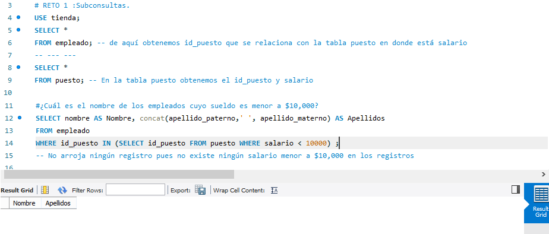
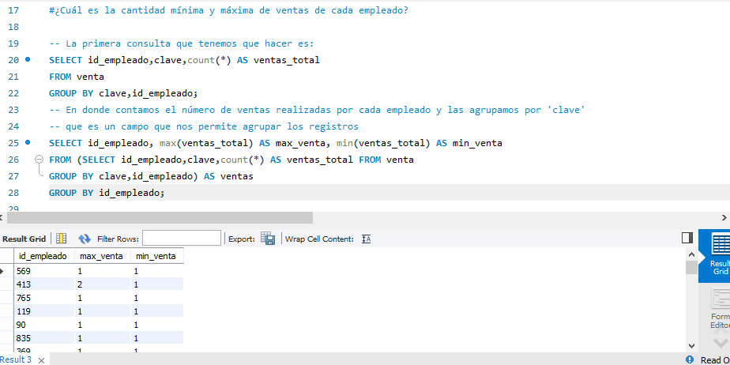
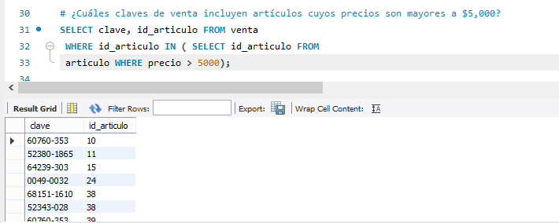
## :pushpin: Reto 2: Joins.
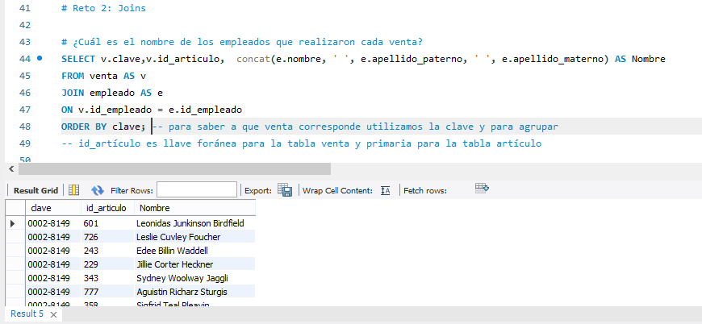
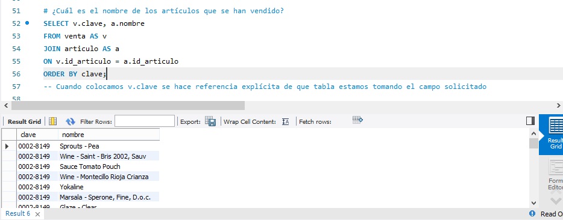
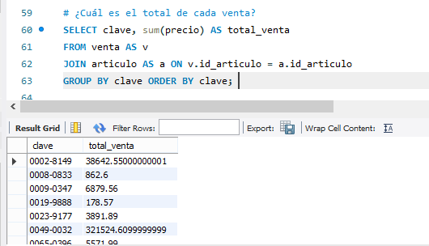
## :pushpin: Reto 3: Definición de vistas.
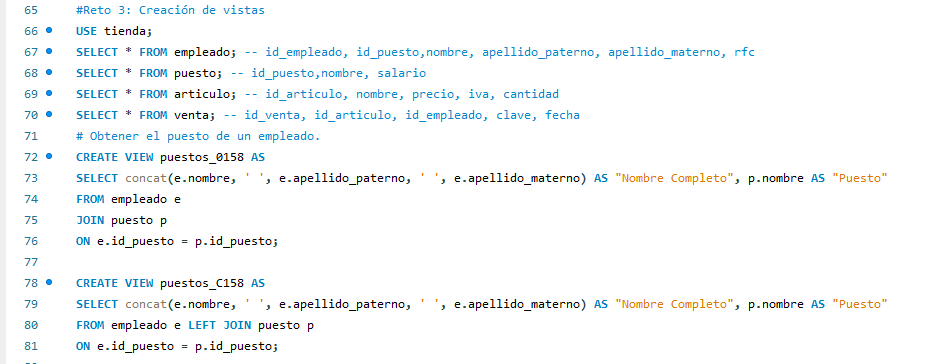
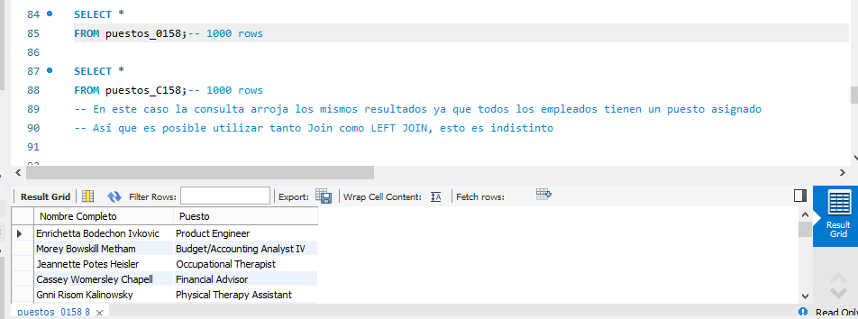
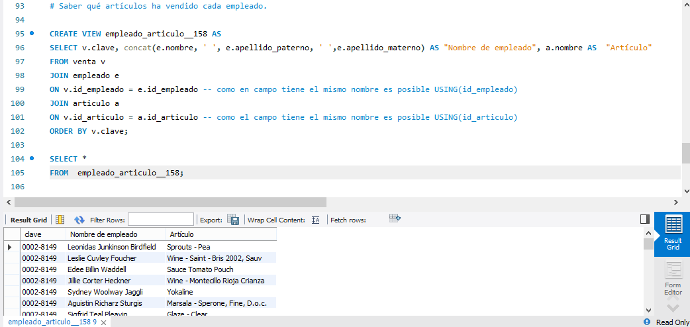
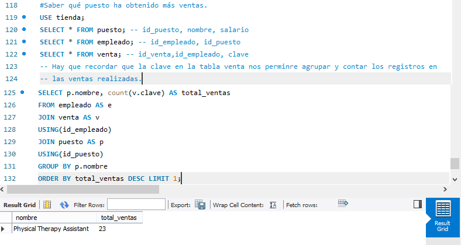
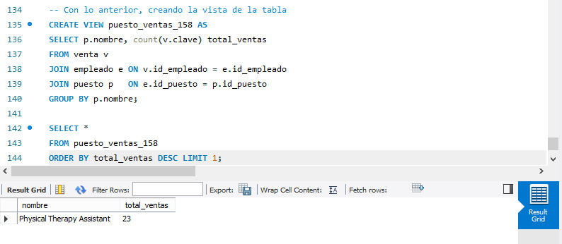
